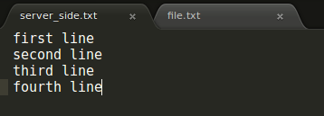
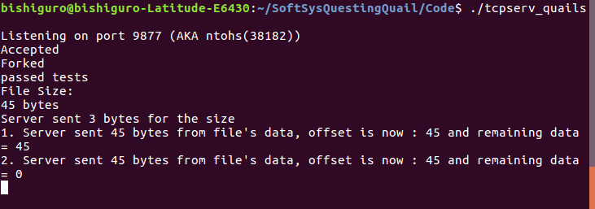
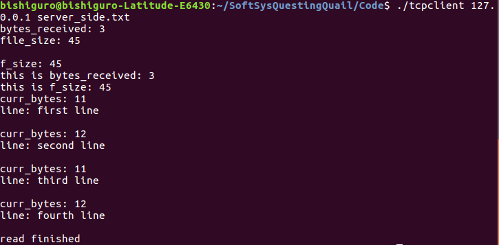
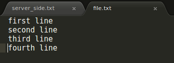

##Abstract
This file transfer server implements a reduced version of the HTTP protocol so that clients can request files by name using GET requests.  This is built on top of a TCP server, which is patterned from code in Unix Network Programming by W. Richard Stevens [3].  We also referenced the code from [4] to better understand the FTP protocol while building our server and client.  

##Background
The HTTP server/client we made has a similar framework to any general website you would find on the internet. Our clients can use GET requests to ask the server for a specific page, and the server dynamically finds and returns the requested page if it is available, the same way most websites work. The key difference between our client and a traditional “browser” is the visualization part. As it stands, our client simply receives files and allows the user to browse them at their leisure. In a broader sense, this is what more sophisticated client/server relationships look like. A FTP server implementing HTTP receives a GET request from a client, sends the information to the client in the form of a html or JavaScript or some other kind of file, and the client displays that file in some human readable format like a web page.  
We use the C socket library to allow our server to talk to our client.  A socket is a communication channel between two processes, either on the same machine or on different machines that communicate over a network.  There are a series of steps that are required to establish a connection between server and client.  First the socket needs to *bind()* to a port, a communication endpoint that represents a specific process on the machine, using a socket descriptor and a socket name.  Next the client has to *connect()* to the socket, using the socket descriptor, the socket address which contains the IP address and the port number, and the socket address length.  The server uses *listen()* to allow clients to connect to it via the socket.  This is a system call that sets the number of client connections that are allowed in its incoming queue at any time.  The server calls *accept()*, a system call that retrieves a client from its incoming queue and returns a second socket descriptor that is used to communicate with said client.  The original socket descriptor is then free to listen for new connections.  Once a connection between server and client is established, the *send()* and *recv()* calls are typically used to communicate over the socket.  send() takes as the parameters the socket descriptor, a pointer to the data to send, the length of the data in bytes, and any flags.  recv() takes the socket descriptor, the buffer to read information into, the maximum length of the buffer, and any flags.  In the case of our client, we use the function *Readline()* instead of recv(), which is similar but receives one line at a time and has no option to set any flags.  

##Implementation
Over the course of our project, we refined our end-goal several times. What we eventually settled on was a list of steps beginning with creating a TCP server/client, going to a FTP server/client, and ending with an HTTP server/client. Once we had a basic implementation of HTTP, we set to accomplishing stretch goals like allowing the client to specify what file they wanted, what the filename of the resulting file should be, and making the server interpret filenames and return what was expected. We had the server use forked child processes to manage a significant number of simultaneous requests from users without forcing them to wait in queues for service and allowing the server itself to be relatively load free.  
Throughout the project we had a few choices to make in terms of what protocols we wanted to implement and how low level to get when building the code ourselves. Did we want to try building system calls from scratch or just utilize them as they were? What would provoke the most learning for our team? Ultimately, we decided to keep with the common standard for system calls that set up the connections between client and server and dove instead into understanding and expanding the information that passed between the server and client. We decided to start at the TCP level for server and client because it’s a fairly simple protocol and wouldn’t do too much of the work for us. We wanted to have to understand what was going on well enough to change the protocol later and make it perform more sophisticated tasks like file transfer and processing client input dynamically. Starting at the basic TCP level gave us room to grow and expand under our own priorities instead of trying to conform to a standard we barely understood. Instead of going from there to the peer to peer route, we decided to make a client/server FTP server. We felt it was more compelling and interesting to have to block out a specific server and a specific client and program their behaviors separately rather than have both sides function as both.  
Not everything in the project went smoothly. We had a few circumstances where both our newness to C and the relative difficulty of debugging over a network connection combined to keep us from figuring out what we later realized were easy problems. One major issue that came from a fairly small problem was the way our server communicated with our client. We had originally had the server always send character arrays of a set size, which worked under certain conditions but not at all under others. What we saw was that whenever we sent information from the server to the client that some of it would go missing and sometimes it was just wrong. We eventually found that the reason was the unchanging size of the character array we stored the information in, and that the problem stemmed from the extra memory, that we assumed was made up of null characters, was actually gibberish and random data because we didn’t use memset() on it before writing to it. This gibberish data interacted badly with the Readline() function and resulted in the data not being processed correctly by the client we had written. The two potential solutions for this that we found were either to memset() the memory as soon as it was instantiated or to make the char array always be the size of the information it was sending. Both effectively prevented gibberish data from being sent. Solving this problem was an effective learning experience for all of us. Over the course of solving it, we realized that our debugging strategy, which was having four people try and debug on the same computer at the same time, was not as effective as pairs of people. We also found that pairs had an advantage over individuals because two brains working on a problem usually prevent silly mistakes and tend to keep the debugging process focussed. We also learned about new tools that we felt could help us more effectively debug server problems in the future like packet sniffers. Using that, we could have determined exactly what the server sent and come to the realization that the problem was on the server side.  
Other challenges we were presented with ranged from our lack of both knowledge of C and exposure to network programming, which we attempted to rectify with extensive reading on the subject and code read-throughs. Code read-throughs were when the team put a piece of code that did something similar to what we wanted to do up on a big screen and went through it line by line. The goal, which was usually successful, was to have everyone be on the same page as to what we were doing, the tools we were working with, and to have people fill in other’s knowledge gaps.  

##Results
 

Figure 1: This is a text file that clients can request from the server, server_side.txt.

Figure 2: This is our server after it has sent the file requested by the client.

Figure 3: This is the client, which connects to the server using an IP address and the name of the file that it is attempting to request.

Figure 4: This is the file that the client writes the data returned from the server into.  In this case, it is ultimately identical to the requested file, server_side.txt.

##Annotated Bibliography

###Griffiths, David, and Dawn Griffiths. Head First C. Beijing: O'Reilly, 2012. Print.

We are using Chapter 11 (Sockets and Networking) of this textbook to learn the basics of creating web server and client programs in C. We are also getting general C knowledge from the rest of the text to facilitate our use of the language for higher purposes.

###Hall, Brian. "Beej's Guide to Network Programming." Beej's Guide to Network Programming. N.p., 8 June 2016. Web. 21 Jan. 2017.

We are using this guide as a resource for networking concepts and implementation using the C socket libraries.

###Stevens, W. Richard. UNIX Network Programming. Englewood Cliffs, NJ: Prentice Hall, 1990. Print.

This book contains C code for a TCP server and includes an exercise for modifying the code to implement a simple HTTP server.  We plan to work through this exercise as a boilerplate for our project.
###TOC. "C Send and Receive File." Stack Overflow. N.p., 16 Aug. 2012. Web. 5 Feb. 2017.

We used the accepted answer of this Stack Overflow question as a model for sending and receiving a file with the system calls of the C socket library.